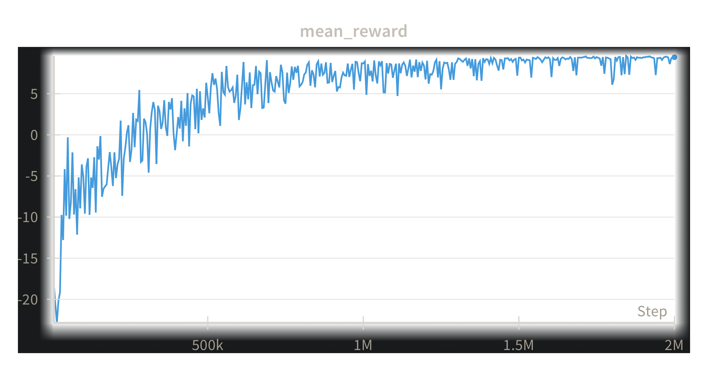

# Playing Hockey with RL (TD3)

## Todos:

- [ ] One file with all of our agent interfaces for loading and submission
- [x] Overleaf template + project setup
- [ ] Tournament setup
- [ ] Chase + Linus checkpoints to evaluate flipping
- [ ] `wandb` setup

## Twin Delayed Deep Deterministic Policy Gradients

### Mean Eval Reward:

After 2 million steps, the average reward against the basic opponent is 9.43

### Episodes v/s Timesteps:

